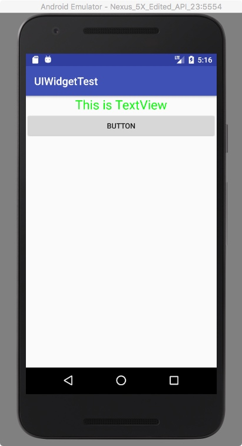
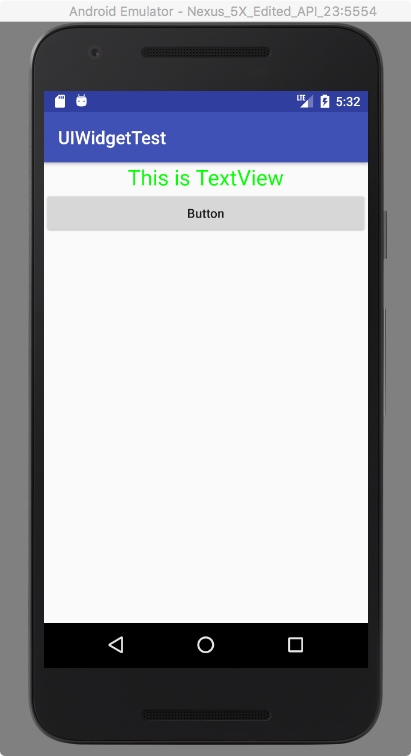

# Button

## 创建Button

在 xml 文件中 添加下面的代码：

```
    <Button
        android:id="@+id/button"
        android:layout_width="match_parent"
        android:layout_height="wrap_content"
        android:text="Button"
       />
```

效果图：



观察效果图，我们设置Button的text是 `Button` ，显示的却是 `BUTTON`。 这是由于系统会对Button中所有英文字母自动进行大写转换，使用如下配置来禁用这一默认特性。

```
    <Button
        android:id="@+id/button"
        android:layout_width="match_parent"
        android:layout_height="wrap_content"
        android:text="Button"
        android:textAllCaps="false"/>
```
效果图：



## 为Button添加点击事件

方法一： 使用匿名类的方式来注册监听器   

   在MainActivity类中为Button的点击事件注册一个监听器
                     
```  
public class MainActivity extends AppCompatActivity {

    public static final String TAG = "MainActivity";

    @Override
    protected void onCreate(Bundle savedInstanceState) {
        super.onCreate(savedInstanceState);
        setContentView(R.layout.activity_main);

        Button button = (Button) findViewById(R.id.button);
        button.setOnClickListener(new View.OnClickListener() {
            @Override
            public void onClick(View v) {
                Log.d(TAG, "onClick");
            }
        });
    }
}
```
方法二： 使用实现接口的方式来进行注册

```
public class MainActivity extends AppCompatActivity implements View.OnClickListener {

    public static final String TAG = "MainActivity";

    @Override
    protected void onCreate(Bundle savedInstanceState) {
        super.onCreate(savedInstanceState);
        setContentView(R.layout.activity_main);

        Button button = (Button) findViewById(R.id.button);
        button.setOnClickListener(this);
    }

    @Override
    public void onClick(View v) {
        switch (v.getId()) {
            case R.id.button:
                Log.d(TAG, "onClick");
                break;
            default:
                break;
        }
    }
}
```

