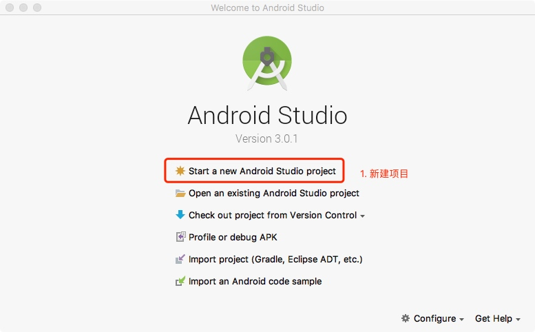
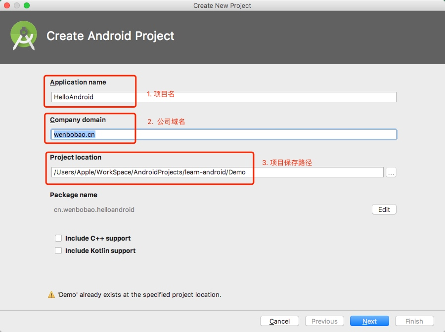
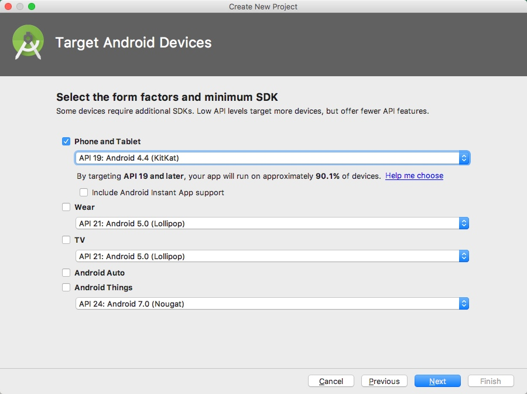
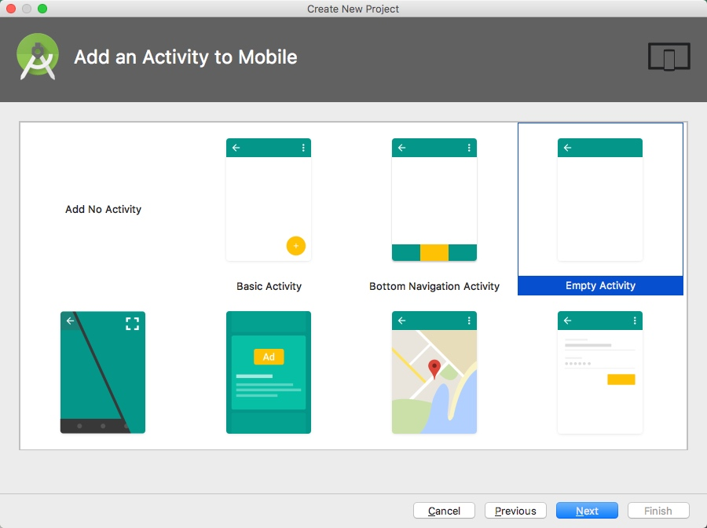
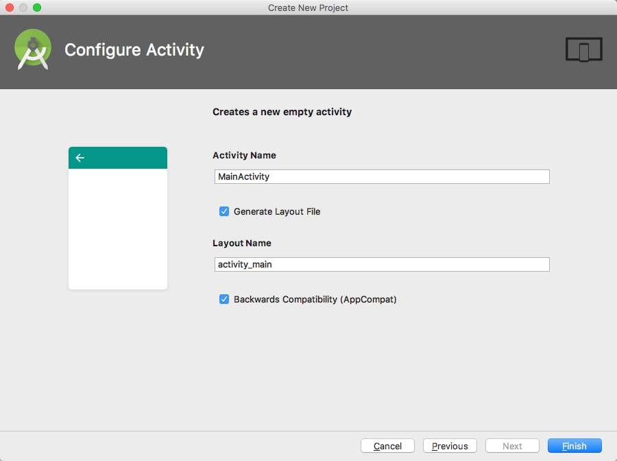
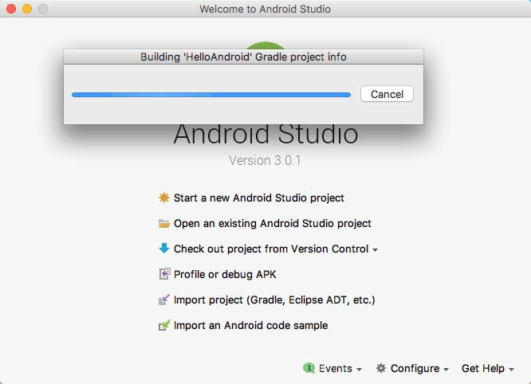
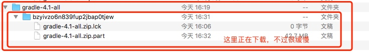
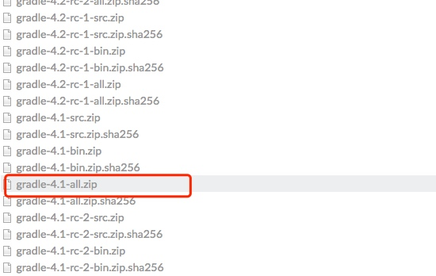
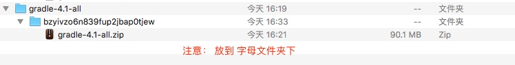

# 开发环境
1. Mac电脑
2. 安装JDK
3. 安装Android Studio

# 创建第一个android项目
1. 打开Android Studio, 点击 Start a new Android Studio project 


2. 填写项目信息 


3. 点击Next  


4. 选择Empty Activity, 点击 Next


5. 点击Finish 完成项目创建。


6. 接下来就会通过Gradle构建项目


7. 如果你等待很长时间，仍然没有构建好项目的话，可以点击 cancel，手动构建项目。
步骤:
    1. 在终端输入命令 
    ```
    open .gradle/wrapper/dists/
    ```
    2. 会看到如下目录 
    

    3. 打开 下面的网址 https://services.gradle.org/distributions
    4. 在网站里面找到文件夹对应的zip， 用迅雷下载，手动放到目录下即可。


gradle.zip下载地址通用格式为： 
https://downloads.gradle.org/distributions/gradle-4.1-all.zip




